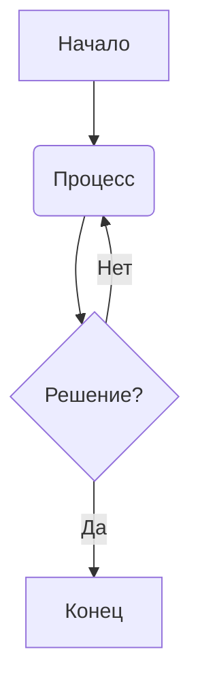

Команда: 
mmdc -i diagram.mmd -o diagram.svg

PATH=C:\Program Files\nodejs;C:\Users\IG\AppData\Roaming\npm;%PATH%


##Тоже работает, но не переносится в другую среду
@echo off
C:\Users\IG\AppData\Roaming\npm\mmdc.cmd -i diagrams\diagram.mmd -o diagrams\diagram.svg


# 🔥 Как работает генерация диаграмм в Mermaid?

Mermaid **не является языком программирования** (как Python или SQL), а представляет собой **язык разметки для описания диаграмм**. Он похож на **Markdown**: ты пишешь структурированный текст, а Mermaid превращает его в графическое представление.

---

## ✅ Как работает код Mermaid?

### 📌 Код:


📖 Разбор кода построчно:

- `graph TD;` — Создаёт граф (диаграмму).
  - `TD` означает "Top to Down" (сверху вниз).
  - Возможные другие направления:
    - `LR` — слева направо (Left to Right).
    - `BT` — снизу вверх (Bottom to Top).
- `A[Начало]` — Создаёт блок с названием `A` и текстом "Начало".
  - Квадратные скобки `[текст]` делают прямоугольник.
- `A --> B` — Создаёт стрелку между элементами (`A --> B` рисует стрелку от `A` к `B`).
- `B(Процесс);` — Круглые скобки `(текст)` создают скруглённый блок (процесс).
- `C{Решение?};` — Фигурные скобки `{текст}` делают ромб (условие / вопрос).
- `C -->|Да| D[Конец];` — `|Да|` подписывает стрелку.
  - `D[Конец]` — создаёт конечный блок.
- `C -->|Нет| B;` — Стрелка назад создаёт цикл.

🎯 Итоговая блок-схема:
📌 Начало → Процесс → Вопрос → (Да → Конец) или (Нет → обратно в процесс).

---

## ✅ Как `mmdc` генерирует диаграмму?

Когда ты запускаешь команду:

```sh
mmdc -i diagram.mmd -o diagram.svg
```

происходит следующее:

1. **Mermaid CLI (mmdc)** читает файл `diagram.mmd`, который содержит код Mermaid.
2. **Он передаёт код в движок рендеринга** (Puppeteer, основанный на Chromium).
3. **Puppeteer превращает текст в графику.**
4. **Создаётся файл `diagram.svg`**, который можно открыть в браузере.
   - `SVG` — это векторный формат, поэтому диаграмма остаётся чёткой при любом масштабе.

---

## ❓ Mermaid — это язык программирования?

**Нет! 🚀**  
Mermaid — это язык разметки, похожий на:

- **Markdown** (для форматирования текста).
- **Graphviz DOT** (для графов).
- **HTML** (для веб-страниц).

📊 Отличие от Python и SQL:

| Язык   | Что делает? |
|--------|------------|
| **Python** | Полноценный язык программирования с логикой, переменными, циклами |
| **SQL** | Запросы к базе данных |
| **Mermaid** | Только визуализация процессов, без вычислений и логики |

📌 **Mermaid не выполняет вычисления и не хранит данные, он только визуализирует процессы.**

---

## 🚀 Вывод

✅ **Mermaid — это язык разметки для диаграмм, а не язык программирования.**  
✅ **Ты пишешь текст, а Mermaid превращает его в графику.**  
✅ **Генерация через `mmdc` использует Puppeteer, который создаёт SVG.**  
✅ **Mermaid удобен для документации** (`GitHub`, `MkDocs` и т. д.).  


Привет. Я разрабатываю бота для телеграм. Этот бот умеет проверять введенные пользователем юзернеймы на их доступность, а также с помощью AI API генерировать набор
юзернеймов по введенному пользователем контексту. Я считаю, что получившийся бот вполне подходит как MVP, хотя у меня еще множество идей для улучшения и расширения функционала, 
но сейчас я решил зафиксироваться - создать внятную документацию. Следуя принципу agile я хочу чтобы она была минималистична, но достаточна. 
Поэтому я хочу создать в документации общий файл с базовым описанием, файл с навигацией по остальным разделам, файл с архитектурой проекта, 
а также ключевые файлы - USER_FLOW и TECH_FLOW, где описана логика со стороны пользователя и со стороны программы. 
Также я хочу составить  2 диаграммы USER_FLOW и TECH_FLOW с помощью mermaid - в этих диаграмах должна сведена вся логика для наглядности. 
Мой план такой - я даю тебе мои файлы, мы сначала обсуждаем и составляем документацию. Понятно?


